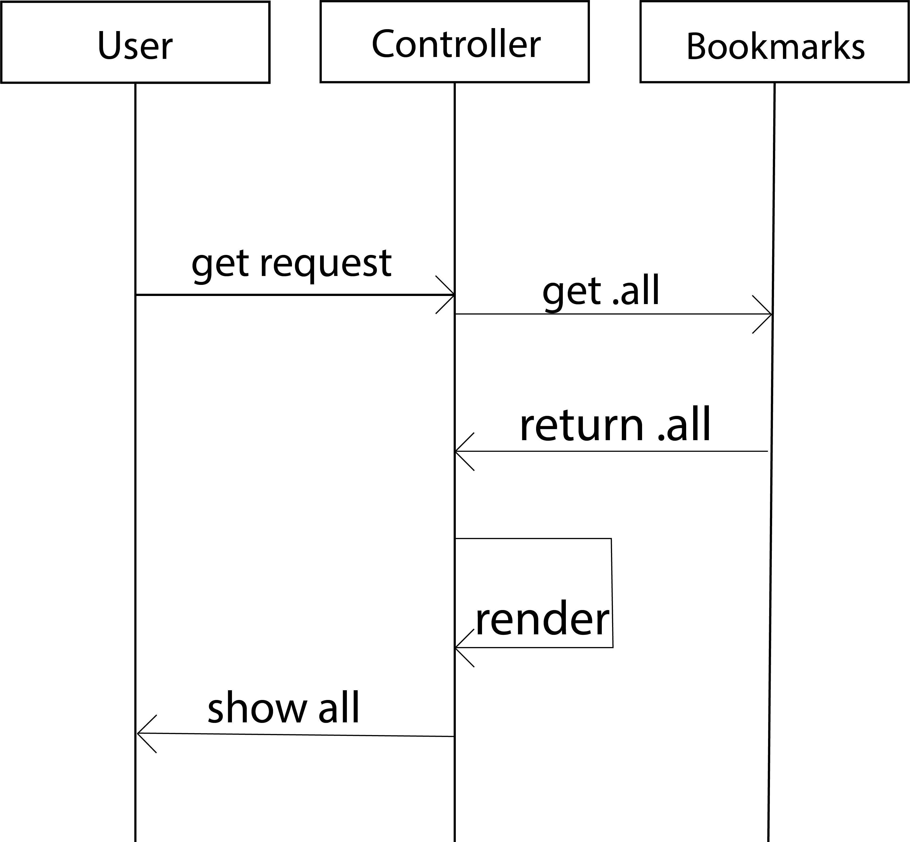

### DATABASES

Connect to `psql` and create the `bookmark_manager` database:

 ```
 CREATE DATABASE bookmark_manager;
 ```

 To set up the appropriate tables, connect to the database in `psql` and run the SQL scripts in the `db/migrations` folder in the given order.

 ### run it

In the command line, type rackup -p 3000

 To view bookmarks, navigate to `localhost:3000/bookmarks`.

 Additionally, create an identical database, named bookmark_manager_test.
 Create an environmental variable containing the name of the bookmark_manager database, named 'database_test'.

### User stories:

```
As a busy person
So i can have quick access to websites I use often
I want to see a list of bookmarks
```
```
As a user
So I keep my list of bookmarks up to date
I want to be able to add bookmarks
```
```
As a user
So I can keep my list of bookmarks up to date
I want to be able to delete bookmarks
```
```
As a user
So I can keep my list of bookmarks up to date
I want to be able to update bookmarks
```
```
As a user
So that I have the best understanding of my bookmarks
I want to be able to comment on my bookmarks
```
```
As a user
So that I have a clear overview of my bookmarks
I want to be able to tag them per catagory
```
```
As a user
So i have fast access to specific bookmarks
I want to be able to filter per tag
```
```
As a user
So that I can keep my bookmarks safe
I want to be the only one to have access to my bookmarks
```

### Domain model


